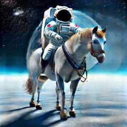
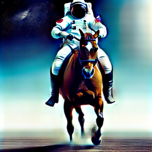

# Learn to Optimize Denoising Scores for 3D Generation: A Unified and Improved Diffusion Prior on NeRF and 3D Gaussian Splatting
### [Project Page](https://yangxiaofeng.github.io/demo_diffusion_prior/) | [Arxiv Paper](https://arxiv.org/abs/2312.04820)


<p style='text-align: justify;'> 
We propose a unified framework aimed at enhancing the diffusion priors for 3D generation tasks. Despite the critical importance of these tasks, existing methodologies often struggle to generate high-caliber results. We begin by examining the inherent limitations in previous diffusion priors. We identify a divergence between the diffusion priors and the training procedures of diffusion models that substantially impairs the quality of 3D generation. To address this issue, we propose a novel, unified framework that iteratively optimizes both the 3D model and the diffusion prior. Leveraging the different learnable parameters of the diffusion prior, our approach offers multiple configurations, affording various trade-offs between performance and implementation complexity. Notably, our experimental results demonstrate that our method markedly surpasses existing techniques, establishing new state-of-the-art in the realm of text-to-3D generation. Furthermore, our approach exhibits impressive performance on both NeRF and the newly introduced 3D Gaussian Splatting backbones. Additionally, our framework yields insightful contributions to the understanding of recent score distillation methods, such as the VSD and DDS loss.
</p>

## Updates
- 07/12/2023: Code Released.


## Installation

- Install pytorch and torch vision
```sh
# torch1.12.1+cu113
pip install torch==1.12.1+cu113 torchvision==0.13.1+cu113 --extra-index-url https://download.pytorch.org/whl/cu113
# or torch2.0.0+cu118
pip install torch torchvision --index-url https://download.pytorch.org/whl/cu118
```

- Install glm (required by 3D Gaussian Splatting)
```sh
sudo apt-get install -y libglm-dev
```

- Install dependencies:
```sh
pip install -r requirements.txt
```

- Install 3DGS and Shap-E:
```sh
pip install ninja
pip install ./gaussiansplatting/submodules/diff-gaussian-rasterization
pip install ./gaussiansplatting/submodules/simple-knn

git clone https://github.com/openai/shap-e.git
cd shap-e
pip install -e .
```

Our codes are based on the implementations of [ThreeStudio](https://github.com/threestudio-project/threestudio) and [GaussianDreamer](https://github.com/hustvl/GaussianDreamer).
If you have any problem with the installation, you may search the issues in these two repos first.
Also feel free to open a new issue here.

## Quickstart
### 2D Playground
```
python 2dplayground_lora.py
python 2dplayground_embedding.py
```
You should get results similar to these:

|      LoRA       |  Embedding |
|:-------------------------:|:-------------------------:|
|   |  |


### Run LODS Embedding + 3D Gaussian Splatting
```
python launch.py --config configs/lods-gs-embedding.yaml --train --gpu 0 system.prompt_processor.prompt="a DSLR image of a hamburger" 
```
### Run LODS LoRA + Instant-NGP
```
python launch.py --config configs/lods-ngp-lora.yaml --train --gpu 0 system.prompt_processor.prompt="a DSLR image of a hamburger"
```
### Run LODS Embedding + Instant-NGP
```
python launch.py --config configs/lods-ngp-embedding.yaml --train --gpu 0 system.prompt_processor.prompt="a DSLR image of a hamburger"
```

## Credits

LODS is built on the following open-source projects:
- **[ThreeStudio](https://github.com/threestudio-project/threestudio)** Main Framework
- **[GaussianDreamer](https://github.com/hustvl/GaussianDreamer)** 3D Gaussian Splatting
- **[3D Gaussian Splatting](https://github.com/graphdeco-inria/gaussian-splatting)** 3D Gaussian Splatting

Credits from ThreeStudio
- **[Lightning](https://github.com/Lightning-AI/lightning)** Framework for creating highly organized PyTorch code.
- **[OmegaConf](https://github.com/omry/omegaconf)** Flexible Python configuration system.
- **[NerfAcc](https://github.com/KAIR-BAIR/nerfacc)** Plug-and-play NeRF acceleration.

## Citation
```
@article{yang2023lods,
  title={Learn to Optimize Denoising Scores for 3D Generation},
  author={Xiaofeng Yang, Yiwen Chen, Cheng Chen, Chi Zhang, Yi Xu, Xulei Yang, Fayao Liu and Guosheng Lin},
  journal={arXiv:2312.04820},
  year={2023}
}
```